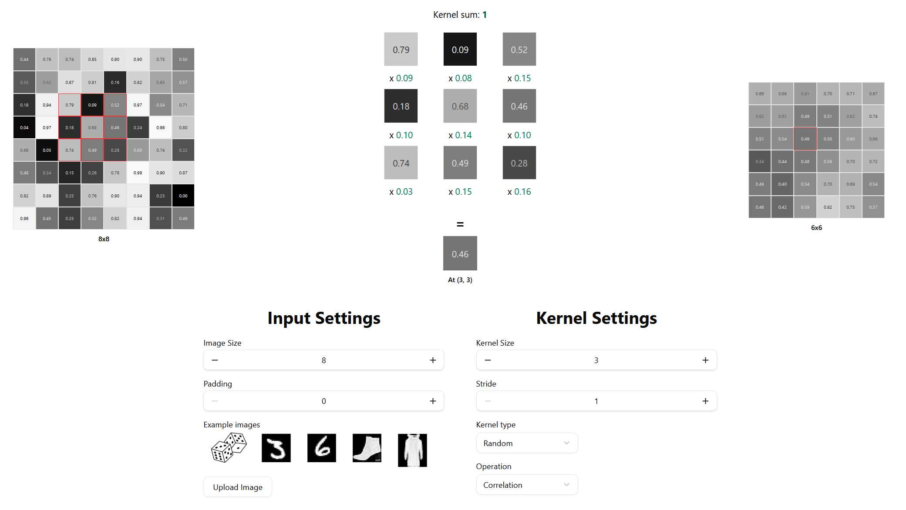

<p align="center">
  
</p>

# Convolution Visual

A collection of tools for visualizing convolution operations.

## Getting Started

**The website is avaliable at:** [https://convolution-visual.vercel.app](https://convolution-visual.vercel.app)

### Local Setup

```bash
git clone https://github.com/sv022/convolution-visual.git
cd convolution-visual
pnpm install
pnpm run dev
```

## License

[](https://opensource.org/licenses/MIT) © 2025 [sv022](https://github.com/sv022)
